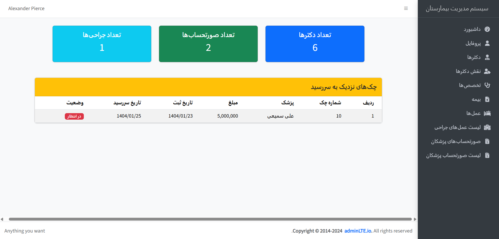
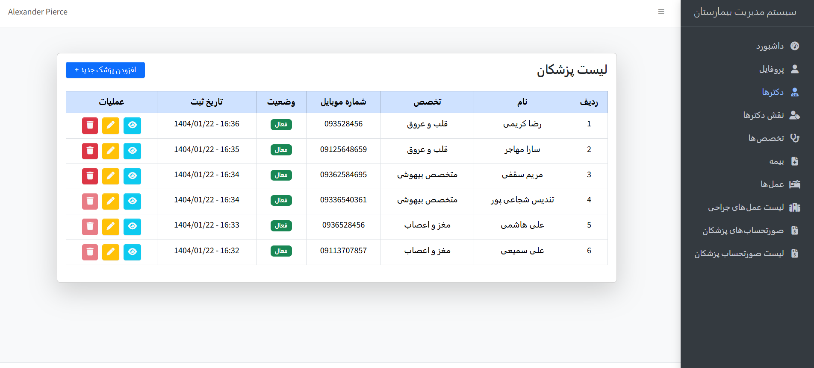
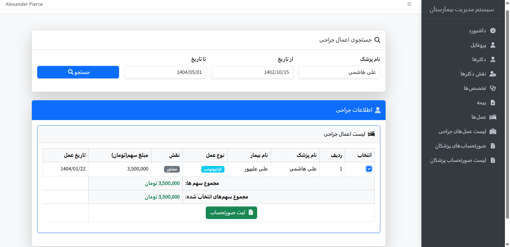

## 🏥 تسویه مالی بیمارستان 
سامانه‌ای برای مدیریت عمل‌های جراحی، پزشکان، صورتحساب‌ها و پرداخت‌های مالی در یک بیمارستان خصوصی

## 📝 درباره پروژه
در این سامانه، پزشکان با تخصص‌های مختلف می‌توانند عمل‌های جراحی انجام دهند. ادمین امور مالی می‌تواند برای پزشکان در بازه‌های زمانی دلخواه صورتحساب صادر کرده و وضعیت تسویه آن‌ها را مدیریت کند.

## ✨ امکانات کلیدی:
- ثبت تخصص‌، نقش پزشک و بیمه (پایه و تکمیلی)
- مدیریت پزشکان و نقش مشارکت در عمل (جراح، مشاور و ...)
- ثبت عمل‌های جراحی با پزشک، بیمه و عملیات‌های انجام‌شده
- صدور صورتحساب برای پزشکان بر اساس سهم مشارکت
- ثبت پرداخت‌ها (نقدی یا چک) با پیوست رسید
- تسویه خودکار صورتحساب پس از تکمیل پرداخت
- سیستم نقش و مجوز (Super Admin / Admin)
- گزارش‌گیری فعالیت‌ها و تنظیمات سیستم

## 🔧 تکنولوژی‌ها و ابزارها:
- PHP 8.x
- Laravel Framework
- MySQL
- Blade Template Engine
- Bootstrap (RTL)
- Spatie Permission Package
- Git & GitHub

## بخش هایی از وب سایت

